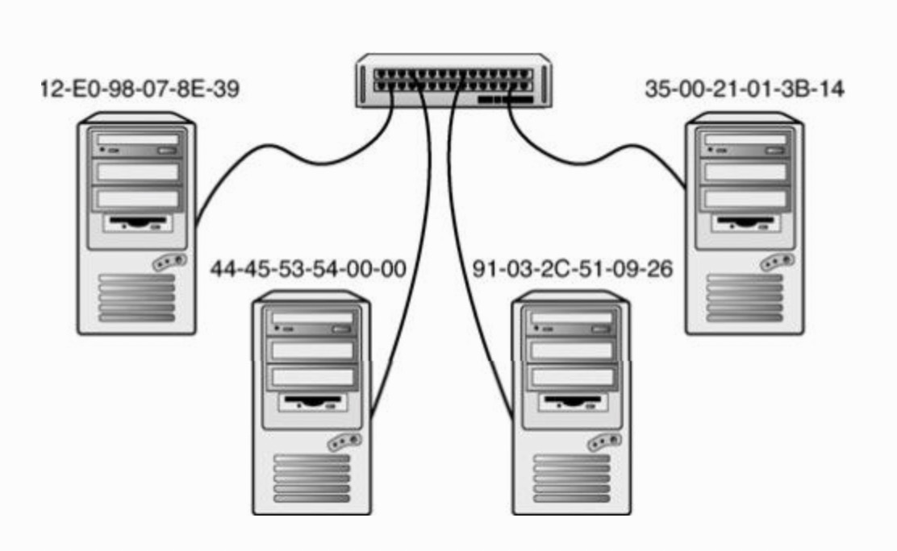

# 连接设备

## 网桥

网桥是根据物理地址过滤和转发数据包的连接设备，它工作于OSI模型的数据链路层（对应于TCP/IP网络的网络访问层）。近些年来，网络倾向于使用功能更强的设备，比如交换机，所以网桥的使用越来越少。但网桥的简单性恰好适合作为讨论连接设备的出发点。

虽然网桥不是路由器，但仍然使用一个路由表作为传输信息的根据。这个基于物理地址的路由表与后面要介绍的路由表相比，不仅具有不同的形式，而且也简单得多。

网桥监听它所连接的每个网段，建立一个表来反映物理地址位于哪个网段。当数据在一个网段上传输时，网桥会查看数据的目的地址，与路由表进行比较。如果目的地址属于发送数据的网段，网桥就忽略这个数据。如果目的地址在不同的网段，网桥就把数据转发到适当的网段。如果目的地址不在路由表中，网桥就会把数据转发到除源网段之外的全部网段。

要记住，网桥使用的基于硬件的物理地址与逻辑IP地址不同。

由于网桥只使用网络访问层的物理地址，不检查IP数据报头中的逻辑地址信息，所以不适合连接非同类网络。网桥也不能用于在大型网络（比如Internet）上实现数据转发的IP路由和传输方案。

## HUB

经典的以太网概念是让全部计算机共享传输介质。每次传输都会被全部网络适配器监听。以太网 HUB 作为一个物理设备从一个端口接收数据，然后把数据重复到其余全部端口（见图9.15）。换句话说，全部计算机就好像是被一条连续线路连接在一起的。HUB不会过滤或路由任何数据，只是接收和重新发送信号。

## 交换机

基于 HUB 的以太网仍然面临着传统以太网的主要问题：性能随着流量的上升而下降。只有当线路空闲时，计算机才能进行传输；而且每个网络适配器都必须接收和处理网络上的每个帧。为了解决这些问题，比 HUB 更智能的设备——交换机——出现了。在其最基本形式下，交换机类似于 HUB，每台计算机也是通过一条线路连接到交换机。但是，交换机知道应该把接收到的数据发送到哪一个端口。大多数交换机把端口与所连接设配器的物理地址关联起来。当一个端口所连接的计算机发送数据帧时，交换机会查看帧的目的地址，把帧发送到与目的地址相关联的端口。换句话说，交换机只向应该接收数据的适配器发送数据帧。这样一来，每个适配器就不必查看网络上传输的全部帧。因此，交换机减少了多余的传输，从而改善了网络性能。

前面描述的1类交换机只操作物理地址，不处理IP地址。交换机不是路由器，实际上它更像网桥，准确地说是更像多个网桥结合在一起。交换机对每个网络连接进行隔离，从而只让针对特定计算机的数据进入特定线路。

* 直通式：交换机一获得目的地址就转发帧。
* 存储转发：交换机在转发之前接收整个帧。这种方法会减缓转发过程，但有时可以改善整体性能，因为可以过滤出碎片和其他无效的帧。