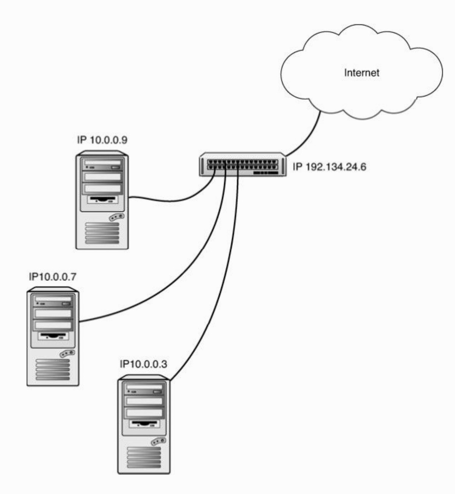

# DHCP - Dynamic Host Configuration Protocol

DHCP是一个用来向计算机分配TCP/IP配置参数的协议。DHCP服务器可以为DHCP客户端提供一组TCP/IP设置，比如IP地址、子网掩码和DNS服务器地址。

因为DHCP是用来分配IP地址的，所以必须使用静态的IP地址信息来配置DHCP服务器。需要在客户端进行配置的唯一一个网络参数是将客户端设置为从 DHCP 服务器接收 IP 地址信息。其他的 TCP/IP 配置都会通过服务传送过来。如果网络上的一些TCP/IP配置发生了变化，网络管理员只需要更新 DHCP服务器，而不用手动更新每一台客户端。

另外，每台客户端的地址都是有租期限制的。在租用到期时，如果客户端不再使用这个地址，此地址将会被分配给其他的客户端。DHCP 的这种租用特性，使得网络不必拥有与客户端相同数量的IP地址。

## 工作过程

当DHCP客户端计算机启动时，TCP/IP软件将被载入到内存中并开始执行相应的操作。然而，因为这时TCP/IP栈还没有IP地址，所以无法直接发送或接收数据包。计算机只能发送和监听广播数据。这种通过广播进行通信的功能正是DHCP进行工作的基础。

1．DHCPDISCOVER：DHCP客户端首先会向UPD端口687（BOOTP和DHCP服务器使用的端口）广播发送一个数据包。这个数据包被称为DHCP DISCOVER消息，任何收到请求配置信息的数据包的DHCP服务器都可以响应这个请求。DHCP DISCOVER数据包中包含了很多字段，但是其中重要的一个是DHCP客户端的物理地址。

2．DHCPOFFER：DHCP 服务器会为网络上的客户端提供可供租用的地址，DHCP 服务的响应数据包被称为DHCP OFFER，此数据包会通过广播发送给发出了DHCP DISCOVER的计算机。这个广播会发送到UDP端口68，并且包含了DHCP客户端的物理地址。此外， DHCP OFFER中还包含了DHCP服务器的物理地址和 IP地址，以及提供给DHCP客户端的IP地址和子网掩码。

3．DHCPREQUEST：客户端选择了一个OFFER数据包后，会构建并广播一个请求数据报。DHCP请求数据报中包含了发送OFFER的服务器的IP地址以及DHCP客户端的物理地址。DHCP请求会执行两个基本任务。第1个是通知被选中的DHCP服务器，客户端请求服务器向它分“配一个IP地址（以及其他配置设置）。第2个任务是通知其他的DHCP服务器它们的OFFER没有被接受。

4．DHCPACK：对于发出的 OFFER 被客户端选中的 DHCP 服务器，在接收到 DHCP请求数据报时，会构造整个租用过程中的最后一个数据报。这个数据报被称为 DHCP ACK （acknowledge的简写）。DHCP ACK中包含了一个租用给DHCP客户端的 IP地址和子网掩码。另外，还可以选择发送DHCP客户端需要配置的默认网关地址、多个DNS服务器地址以及一、两个WINS服务器地址。除了IP地址之外，DHCP客户端还可能接收其他配置信息，例如NetBIOS节点类型（可以改变NetBIOS名称解析的次序）。

## NAT

如果 DHCP 服务器为客户端提供了一个 IP 地址，那么这个地址可能不是一个“公共的”、在Internet上唯一的IP地址。只要路由器自己具有在Internet上有效的IP地址，那么路由器就可以成为网络客户端的代理，从客户端接收请求，向Internet地址空间转发这个请求，进而接收来自于Internet地址空间的响应。许多路由器/DHCP设备都可以提供名为网络地址转换（NAT）的服务。

NAT设备能够屏蔽本地网络的所有细节，事实上，也能够隐蔽本地网络。图12.4所示为一个NAT设备。NAT设备可以作为本地计算机访问Internet的网关。在NAT设备之后，本地网络可以使用任何网络地址空间。当本地计算机需要连接Internet资源时，NAT设备会替这台计算机进行连接。所有从 Internet 资源发送来的数据包都会被转换成本地网络的地址格式，接着被发送给发起连接的本地计算机。

少量的IP地址范围被留给了“私有”网络：

* 10.0.0.0 ～ 10.255.255.255
* 169.254.0.0 ～ 169.254.255.255
* 172.16.0.0～ 172.31.255.255
* 192.168.0.0 ～ 192.168.255.255

NAT设备通常从这些私有地址范围来分配IP地址。这些地址一般意义上是不可路由的，只能通过地址转换来到达NAT客户端计算机。NAT也可以减少各个公司对Internet公共地址的需求。只有充当NAT设备的路由器才需要能够在Internet上使用的真实地址。