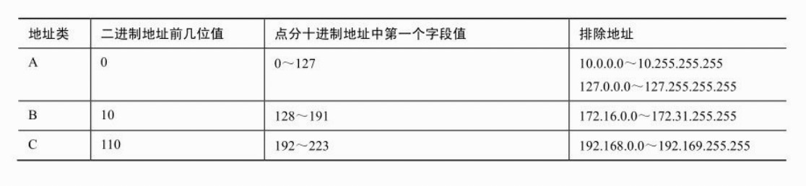

# Internet Layer

在一个网段（比如一个以太局域网）上的计算机之间能够使用网络访问层提供的物理地址进行通信。网际层提供的协议就负责局域网网段之外的传递，其中重要的协议包括IP、ARP和ICMP。

## 寻址

计算机通过网络接口设备（比如网络适配器）与网络进行通信，网络接口设备具有唯一的物理地址，用于接收发向该地址的数据。像以太网网卡这样的设备对于上层协议层的细节是一点也不了解的，它不知道 IP 地址，也不知道发送来的帧是要给 Telnet还是FTP，它只是监听是否收到了数据帧，发现其中目标地址与自己物理地址相符的帧，并把这个帧传递给上层协议栈。
这种物理寻址方式适合单个局域网网段。由不间断介质连接在一起的若干台计算机利用物理地址就可以实现所需的功能。只需使用网络访问层的低级协议就可以把数据从网络适配器直接传递另一个网络适配器。

TCP/IP隐藏了物理地址，以一种逻辑化、层次化的寻址方案对网络进行组织。这种逻辑寻址方案由网际层的IP协议维护，而逻辑地址被称为IP地址。地址解析协议（ARP）是另一种网际层协议，它维护一个表格，用于把IP地址映射到物理地址。这个ARP表连接了IP地址与网卡物理地址。

为了在复杂的路由式网络中传输数据，网际层协议必须具有以下功能：

* 识别网络中所有的计算机；
* 提供一种方式来判断何时需要通过网关来传递消息；
*  提供一种与硬件无关的方式来识别目的网段，从而让数据报能够高效率地经过路由器到达正确的网段；
*  提供一种方式把目标计算机的逻辑IP地址转化为物理地址，让数据能够传输给目的计算机的网络适配器。

## IP

IP地址分为两个部分：

*  网络ID；
*  主机ID。

网络必须提供一种方式来判断IP地址的哪一部分是网络ID，哪一部分是主机ID。该问题最初的解决方案是把IP地址划分为一系列地址类。A类地址使用地址前8位作为网络ID，B类地址使用前16位，C类地址使用前24位。

### 数据报结构

* 版本：这个4位的字段表示所使用的IP版本。目前IP版本是4，相应的二进制是0100。
*  网际报头长度（IHL）：这个4位字段表示IP报头以32位字为单位的长度，即ip报头有多少个32位的长度。IP报头的最小长度是5个32比特字，相应的二进制表示是0101。
*  总长度：这个16位的字段表示IP数据报的长度，单位是字节，这个长度包含了IP报头和数据载荷。
*  标识：这个16位的字段是一个依序变大的数值，分配给源IP发出的消息。当传递到 IP 层的消息太大而不能放到一个数据报里时，IP 会把消息拆分到多个数据报，并对这些数据报排序分配相同的标识号。接收端利用这些数值重组为原始消息。
*  标记：这个字段表示分段可能性。第 1 位未使用，其值应该为 0。第 2 位称为DF（不分段），表示是否允许分段，0表示允许，1表示不允许。第3位是MF（更多分段），表示是否还有分段正在传输，设置为0时表示没有更多分段需要发送，或是数据报根本没有分段。
*  生存时间（TTL）：这个字段表示数据报在被抛弃之前能够保留的时间（以秒为单位）或路由器跳数。每个路由器都会检查这个字段，并且至少把它减去 1，或数据报在路由器中延迟的秒数。当这个字段的值为0时，数据报会被抛弃。
	*  跳数代表数据报到达目的之前必须经过的路由器的数量。如果数据报在到达目的之前经过了5个路由器，我们就说距离目的有5跳。
*  协议：这个 8 位的字段表示接收数据载荷的协议，比如协议标识为 6（二进制为00000110）的数据报会被传递到TCP模块。
	*  1: ICMP
	*  6:TCP
	*  17:UDP
* IP选项：这个字段支持一些可选的报头设置，主要用于测试、调试和安全的目的。这些选项包括严格源路由（数据报必须经过指定的路由）、网际时间戳（经过每个路由器时的时间戳记录）和安全限制。
*  填充：IP选项字段的长度不是固定的。填充字段可以提供一些额外的0，从而保证整个报头的长度是32位的整倍数（报头长度必须是32位字的整倍数，因为“网际头长度（IHL）”字段以32位字为单位表示报头的长度）。

### IP 地址分类

### 特殊的 IP 地址

有一些IP地址具有特殊含义，不会分配给主机。全0的主机ID表示网络本身。例如， IP地址129.152.0.0是指网络ID为129.152的B类网络。

全1的主机ID表示广播。广播是向网络中全部主机发送的消息。IP地址129.152.255.255就是网络ID为129.152的B类网络的广播地址（十进制的255对应于全1的八位组11111111）。

地址255.255.255.255也可以用于网络上的广播。

以十进制值 127 开头的地址是环回地址。目的地址为环回地址的消息是由本地 TCP/IP软件发送的，其目的在于测试TCP/IP软件是否工作正常。

### ARP

局域网上的计算机使用网际层的地址解析协议（ARP）把IP地址映射为物理地址。主机必须知道目的网络适配器的物理地址才能向它发送数据，由此可见，ARP是一个重要的协议。但是TCP/IP的实现方式让ARP和关于物理地址转换的任何细节对于用户来说几乎是完全透明的，对于用户来说，网络适配器就是以 IP 地址标识的。然而在幕后，IP 地址必须映射到物理地址，消息才能到达目的地。

网段上每台主机在内存中都保存着一个被称为 ARP 表或 ARP 缓存的表格，其中包含着网段上其他主机的IP地址与物理地址的对应关系。当主机需要向网段上的其他主机发送数据时，它会查看ARP缓存来获得目的的物理地址。ARP缓存是动态变化的。如果要接收数据的地址当前并不存在于 ARP 缓存，主机就会发送一个名为“ARP 请求帧的广播。

ARP请求帧包含未解析的IP地址，还包含发送这个请求的主机的IP地址和物理地址。网段上的其他主机接收到这个ARP请求，拥有这个未解析IP地址的主机会向发出请求的主机发送自己的物理地址。这个新的IP地址与物理地址的对应关系就会添加到请求主机的ARP缓存里。

### 发送数据

TCP/IP软件使用如下策略在网络上发送数据：

1．如果目的地址与源地址在同一个网段，源计算机就把数据包直接发送给目的计算机。IP地址被ARP解析为物理地址，数据被直接发送到目的网络适配器。

2．如果目的地址与源地址不在一个网段上，就执行如下过程。

a）直接将数据报发送到网关。网关是位于局域网网段上的一个设备，能够把数据报转发到其他网段。网关地址被ARP解析为物理地址，数据被发送到网关的网络适配器。

b）数据报通过网关被路由到较高级别的网段，再次重复上述过程。如果目的地址在这个新网段里，数据就被发送到目的，否则数据报就会被发送到另一个网关。

c）数据报经过一系列网关被转发到目的网段，目的IP地址被ARP解析为物理地址，数据被发送到目的网络适配器。

## Info

* <web.taox@gmail.com>
* [GitHub](https://github.com/Tao-Quixote)