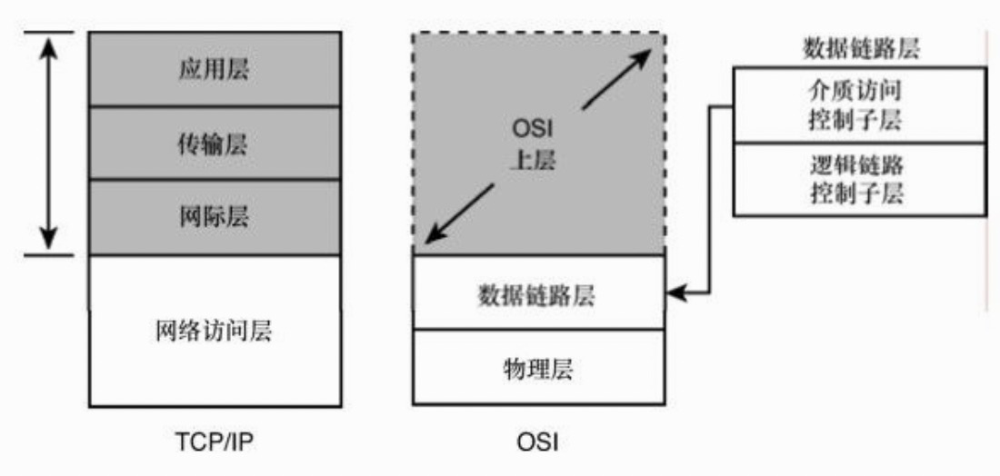
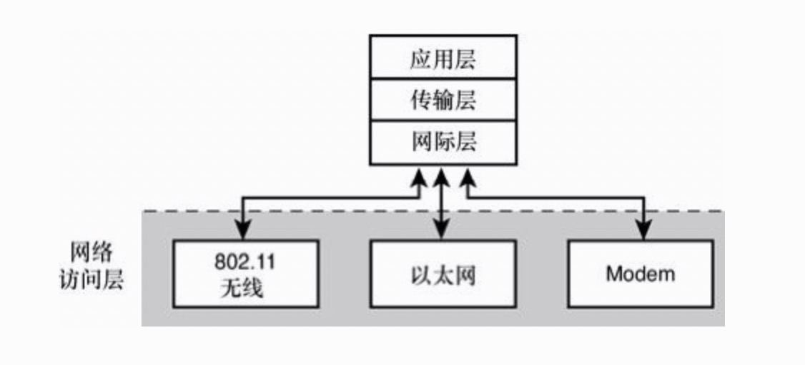
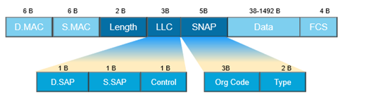

# Network Access Layer（网络访问层）

TCP/IP协议栈的最底层是网络访问层，其中包含的服务与规范提供并管理着对网络硬件的访问。网络访问层是最神秘、最不统一的 TCP/IP 层，它管理为物理网络准备数据所必需的服务与功能。

* 与计算机网络适配器的连接；
* 根据合适的访问方式调整数据传输；
* 把数据转化为电子流或模拟脉冲的形式，以在传输介质上进行传输；
* 对接收到的数据进行错误检查；
* 给发送的数据添加错误检查信息，从而让接收端计算机能够对数据进行错误检查。

网络访问层定义了与网络硬件交互和访问传输介质的过程，在 TCP/IP 网络访问层的下面，将会发现硬件、软件和传输介质规范之间复杂的相互作用。不幸的是，现实世界中存在着很多不同类型的物理网络，它们都具有自己的规范，而且都可能作为网络访问层的底层。

## 网络访问层与OSI模型

TCP/IP网络访问层大致对应于OSI的物理层和数据链路层。OSI的物理层负责把数据帧转化为适合于传输介质的比特流，也就是说，OSI 物理层管理和同步实际传输的电子或模拟脉冲。在接收端，物理层把这些脉冲重新组合为数据帧。



OSI数据链路层执行两个独立的任务，相应地划分为两个子层：

* 介质访问控制（MAC）：这个子层提供与网络适配器连接的接口。实际上，网络适配器驱动程序通常被称为MAC驱动，而网卡在工厂固化的硬件地址通常被称为MAC地址。
* 逻辑链路控制（LLC）：这个子层对经过子网传递的帧进行错误检查，并且管理子网上通信设备之间的链路。

## 网络体系

**网络体系（比如以太网）具有一系列的规范来管理介质访问、物理寻址、计算机与传输介质的交互。<span style="color: red;">在决定网络体系时，实际上是在决定如何设计网络访问层。</span>**

网络访问层以上的协议层不必关心硬件设计的问题。TCP/IP协议栈的设计保证了与硬件交互相关的细节都发生在网络访问层，使得TCP/IP能够工作于多种不同的传输介质。

网络访问层包括如下一些体系：

* IEEE 802.3（以太网）：在大多数办公室和家庭使用的基于线缆的网络。
* IEEE 802.11（无线网络）：在办公室、家庭和咖啡厅使用的无线网络技术。
* IEEE 802.16（WiMAX）：用于移动通信长距离无线连接的技术。
* 点到点协议（PPP）：Modem通过电话线进行连接的技术。

TCP/IP还支持其他一些网络体系。下图可以看到，协议栈的模块化特性使得在网络访问层里与硬件打交道的软件组件能够为和硬件无关操作的上层提供接口。



**由于网络访问层封装了传输介质的细节，因此协议栈的上层可以独立于硬件进行操作。**

网络访问层需要把逻辑IP地址（通过协议软件来配置）与网络适配器的固定物理地址相关联。物理地址通常也被称为MAC地址，这是因为在OSI模型中，物理寻址是由介质访问控制（MAC）子层负责的。由于物理寻址系统是封装在网络访问层中的，所以地址可以根据网络体系规范采用不同的形式。

## MTU(Maximum Transmission Unit)

### 以太网帧

以太网帧的大小为 64Byte - 1518Byte。

IEEE 802.3以太网帧包含以下内容：

* 前导码：表示帧起始的一系列比特（一共8字节，最后一个字节是帧起始符）。
* 目标地址：接收帧的网络适配器的6字节（48比特）物理地址。
* 源地址：发送帧的网络适配器的6字节（48比特）物理地址。
* 可选的VLAN标记：这个可选的16比特字段在802.1q标准中有讲解，其目的是允许多个虚拟LAN通过同一个网络交换机运行。
* 长度：两个字节，表示数据段的长度。
* 数据：帧中传输的数据。
* 帧校验序列（FCS）：帧的4字节（32比特）校验和。FCS是检验数据传输的常见方式。发送方计算帧的循环冗余码校验（CRC）值，把这个值写到帧里。接收方计算机重新计算 CRC，与 FCS 字段的值进行比较，如果两个值不相同，就表示传输过程中发生了数据丢失或改变，这时就需要重新传输这一帧。



以太网上其他网络适配器接收到这个帧，检查其中的目的地址。如果目的地址与网络适配器的地址相匹配，适配器软件就会处理接收到的帧，把数据传递给协议栈中较高的层。

### 1518 是怎么来的

以太网的 MTU 是 1500Byte，那么这个数字是怎么来的，这个涉及到传输时间以及传输效率的问题。传输时间公式如下：

```
(MTU * 8)/(BW * 1024 * 1024) * 1000
```

上面的 BW 为带宽，单位为 M；传输时间的单位为毫秒。

传输效率公式如下：

```
(MTU  - 14 - 4) / MTU
```

上面的 14 为 D.MAC + S.MAC + Length，4 为 FCS(尾部校验和)。

基于以太网的特点（载波监听多路复用/冲突检测 - CSMA/CD），所以要对传输时间以及传输效率做折中，所以才有了 1518。

所以，虽然 IP 数据包的长度最大可以为 65535Byte，但是到了 网络访问层(OSI中的数据链路层)，都会被拆分为 1500B 的帧(纯数据部分)。

## refs

* 部分摘录来自: [美]Joe Casad. “TCP/IP入门经典(第5版) (计算机编程入门经典系列 33)。
* [什么是MTU？为什么MTU值普遍都是1500？](https://blog.csdn.net/passionkk/article/details/100538418)

## Info

* <web.taox@gmail.com>
* [GitHub](https://github.com/Tao-Quixote)