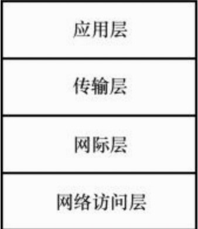
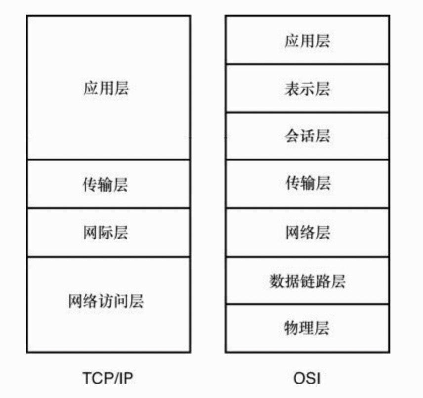
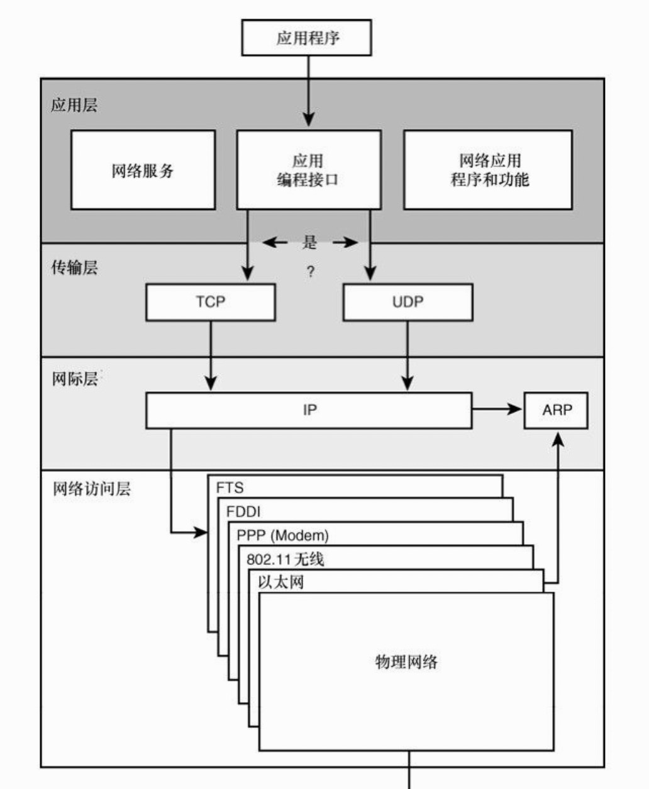

# TCP/IP model

## models

|name|desc|
|----|----|
|应用层|为网络排错、文件传输、远程控制和 Internet 操作提供了应用程序，还支持应用编程接口（API），从而使得针对特定操作系统编写的程序能够访问网络。|
|传输层（TCP/UDP）|为网络提供了流量控制、错误控制和确认服务。充当网络应用程序的接口。|
|网际层（IP/ARP）|提供独立于硬件的逻辑寻址，从而让数据能够在具有不同物理结构的子网之间传递。提供路由功能来降低流量，支持网间的数据传递（术语“网间”（internetwork）指的是多个局域网互相连接而形成的较大的网络，比如大公司里的网络或Internet）。实现物理地址（网络访问层使用的地址）与逻辑地址的转换。|
|网络访问层 |提供了与物理网络连接的接口。针对传输介质设置数据的格式，根据硬件的物理地址实现数据的寻址，对数据在物理网络中的传递提供错误控制。|

## TCP/IP model VS OSI model

## OSI

网络业界针对网络协议体系有一个标准的七层模型，称为“开放系统互连（OSI）”模型，这是ISO（国际标准化组织）为了标准化网络协议系统所做出的规范，旨在提高网络互连性，并且方便软件开发人员以一种开放方式来使用协议标准。

当OSI标准体系出现时，TCP/IP已经处于开发过程之中了。严格来讲，TCP/IP没有遵守OSI模型，然而这两种模型的确具有类似的目标，而且它们的设计者之间有足够的交互，所以它们具有一定的兼容性。OSI 模型对于协议实现的开发与发展具有非常大的影响力

OSI模型的7层分别如下所示:

* 物理层：把数据转换为传输介质上的电子流或模拟脉冲，并且监视数据的传输。
* 数据链路层：提供与网络适配器相连的接口，维护子网的逻辑链接。
* 网络层：支持逻辑寻址与路由选择。
* 传输层：为网络提供错误控制和数据流控制。
* 会话层：在计算机的通信应用程序之间建立会话。
* 表示层：把数据转换为标准格式，管理数据加密与压缩。
* 应用层：为应用程序提供网络接口，支持文件传输、通信等功能的网络应用。”

## TCP/IP 网络

1、数据从工作于应用层的协议、网络服务或应用编程接口（API）通过TCP或UDP端口传递到两个传输层协议（TCP或UDP）中的一个。程序可以根据需要通过TCP或UDP访问网络。

2、数据分段传递到网际层，IP协议在此提供逻辑寻址信息，并且把数据封装为数据报。

3、IP 数据报进入网络访问层，传递到与物理网络相连接的软件组件。网络访问层创建一个或多个数据帧，从而进入到物理网络。在像以太网这样的局域网系统中，帧可能包含从表格里获得的物理地址信息，而这些表格是由网际层的ARP维护的（ARP是地址解析协议，把IP地址网际层的ARP维护的（ARP是地址解析协议，把IP地址转换为物理地址）。

4、数据帧被转化为比特流，通过网络介质进行传输。

## 网络访问层

网络访问层提供了与特定物理网络相关的服务，包括基于特定传输介质（比如以太网电缆）准备、发送和接收数据帧。

## Refs

摘录来自: [美]Joe Casad. “TCP/IP入门经典(第5版) (计算机编程入门经典系列 33)。

## Info

* <web.taox@gmail.com>
* [GitHub](https://github.com/Tao-Quixote)