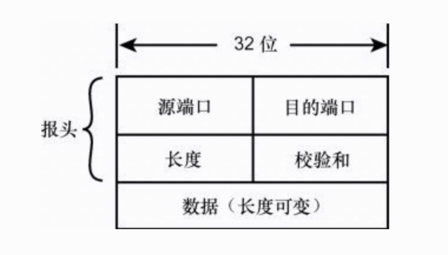

# Transport Layer

TCP/IP传输层包含很多有用的协议，能够提供数据在网络传输所需的必要寻址信息。

* 为网络应用程序提供接口：也就是为应用程序提供访问网络的途径。设计者希望不仅能够向目的计算机传递数据，还能够向目的计算机上的特定程序传递数据。
*  多路复用/多路分解机制：这里的多路复用表示从不同的应用程序和计算机接收数据，再把数据传递到目的计算机上的接收程序。换句话说，传输层必须能够同时支持多个网络程序和管理传递给网际层的数据流。在接收端，传输层必须能够从网际层接收数据，把它转发到多个程序，这种功能被称为多路分解，它可以让一台计算机同时支持多个网络程序。
* 错误检测、流量控制和验证：协议系统需要一种全面机制来确保发送端与接收端之间的数据传输。

## 面向连接的协议和无连接的协议

为了针对不同情况提供不同程度的质量保证，传输层提供了两种不同的协议原型：

*  面向连接的协议：会在通信计算机之间建立并维护一个连接，并且在通信过程中监视连接的状态。换句话说，通过网络传输的每个数据包都会有一个确认，发送端计算机会记录状态信息来确保每个数据包都被正确无误地接收了，并且在需要时会重发数据。当数据传输结束之后，发送端和接收端计算机会以适当方式关闭连接。
*  无连接的协议：以单向方式向目的发送数据报，不承担通知目的计算机关于数据发送的职责。目的计算机接收到数据后也不需要向源计算机返回状态信息。

## 多路复用/多路分解

多路复用是指把多个来源的数据导向一个输出，而多路分解是把从一个来源接收的数据发送到多个输出。

多路传输/多路分解让TCP/IP协议栈较低层的协议不必关心哪个程序在传输数据。与应用程序相关的操作都由传输层完成了，数据通过一个与应用程序无关的管道在传输层与网际层之间传递。

多路复用和多路分解的关键就在于套接字地址。套接字地址包含了IP地址与端口号，为特定计算机上的特定应用程序提供了一个唯一的标识。

## TCP：面向连接的协议

* 面向流的处理：TCP以流的方式处理数据。换句话说，TCP可以一个字节一个字节地接收数据，而不是一次接收一个预定义格式的数据块。TCP把接收到的数据组成长度不定的段，再传递到网际层。
*  重新排序：如果数据以错误的顺序到达目的，TCP模块能够对数据重新排序来恢复原始顺序。
*  流量控制：TCP的流量控制特性能够确保数据传输不会超过目的计算机接收数据的能力。由于现实世界里会有各种不同的应用环境，处理器速度和缓存区大小的差别也可能很大，所以这种流控制能力是非常重要的。

### 流量控制

TCP报头中的“窗口”字段为连接提供了一种流量控制机制，其目的是防止发送端计算机不要发送得太快，以避免接收端计算机来不及处理接收到的数据而导致数据丢失。TCP使用的流量控制方法被称为“滑动窗口”方法。接收端计算机利用“窗口”字段（也被称为“缓存大小”字段）来定义一个超过最后一个已确认序列号的序列号“窗口”，在这个范围内的序列号才允许发送端计算机进行发送。发送端计算机在没有接收到下一个确认消息之前不能发送超过这个窗口的序列号。

## UDP：无链接协议

UDP 协议的主要用途是把数据报传递给应用层。UDP不会重新传输丢失或损坏的数据报、重新排列混乱的接收数据、消除重复的数据报、确认数据报的接收、建立或是终止连接。它主要是在程序不必使用TCP连接开销的情况下发送和接收数据报的一种方式。如果上述功能对于应用程序来说是必需的，它可以自己提供这些功能。

* 源端口：这个字段占据UDP报头的前16位，通常包含发送数据报的应用程序所使用的UDP端口。接收端的应用程序利用这个字段的值作为发送响应的目的地址。这个字段是可选的，发送端的应用程序不是一定要把自己的端口写在这个字段中。如果发送端的应用程序不写入其端口号，就应该把这个字段全置为 0。显然，如果这个字段没有包含有效的端口地址，接收端的应用程序就不能发送响应。然而有时这可能正是我们想要的功能，比如单向消息就不需要响应。
*  目的端口：这16位字段包含的端口地址是接收端计算机上UDP软件使用的端口。
*  长度：这 16 位字段以字节为单位表示 UDP 数据报的长度。这个长度包括了 UDP报头和UDP数据载荷。因为UDP报头的长度是8字节，所以这个值最小是8。
*  校验和：这16位字段可以检验数据在传输过程中是否损坏。校验和是对二进制数据串执行特殊计算而得到的结果。对于UDP来说，校验和是基于伪报头、UDP报头、UDP数据和填充的0而计算的。源计算机生成校验和，目的计算机对它进行检验，让客户端用用程序能够判断数据报是否完整。

## Info

* <web.taox@gmail.com>
* [GitHub](https://github.com/Tao-Quixote)